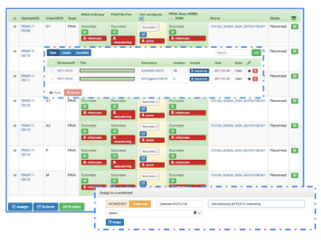

# Penelope
### A complete Laboratory Information Management System for Next Generation Sequencing Laboratories
<hr>

## Motivation
NGS laboratories are nowadays faced with hard challenges, due to the continuously increasing data volumes and sample 
throughput and to the advances in sequencing technology. Some of these challenges are:

- Standardization of data processing and data set procedures are requested  for the full exploitation of the potential 
  of genetic information in clinical research.

- Provenance information should be tracked to support the re-usability of existing workflows. 

- Streamlining of laboratory operations

In response to these challenges, we have released **Penelope**,  a web-based  Laboratory Information Management System (LIMS)
to support the production of accurate, reproducible and provenance aware data faster and more reliably. 
**Penelope**, which is currently in production at the CRS4 NGS Core Facility laboratory (http://next.crs4.it), 
supports seamlessly management of samples, allowing data from sequencing runs easier to manage, store, and track.

## The System Core
The core of the penelope system is [*BIKA*](https://www.bikalims.org/), an open source, ISO 17025 compliant community-based LIMS.

- Handles roles and authorizations

- Manages inventory and supply chain

- Tracks samples

- Prioritizes analysis requests

- Organizes worksheets per project


However, BIKA has been designed for clinical and medical laboratories. Its database schema does not meet natively all 
the needs of a NGS laboratory operational workflow.

## The System Architecture

In order to reshape the database schema we have developed a three layer model-view-controller (mvc) architecture: 


- a Python client library that overlaps native API: 
  [bika.client](https://pypi.org/project/bikaclient)
  1. Oversees and simplify connection and common CRUD (Create, Read, Update, Delete) operations
  2. Extends them with more complex and dedicated queries. 

- a Python REST Web Service that exposes remodeled methods and features: 
  [back](https://github.com/next-crs4/penelope/tree/main/back)
  1. Receives the user's request from the web application and drives it to the client for execution. 
  2. The response from the client is packaged according to an appropriate format and sent back to the web application.

- a Web application based on AngularJS that implements the MVC pattern: 
  [front](https://github.com/next-crs4/penelope/tree/main/front)
  1. Implements the MVC pattern and exposes a graphic interface to the  users:
      1. carries out a logical overwriting of the native Bika database schema
      2. manages the application logic and the interactions between the objects
      3. shows data to the wet laboratory technicians, exposing them in modules and tables for easy and immediate review




##  Results
**Penelope** manages the objects and events of a NGS Sequencing Laboratory. 
The essential objects are the samples, the sequencing machines, the whole laboratory supply chain, the customers, 
research partners and budget requirements. In turn, events span the "life cycle" of those objects,
with reference for example to the acceptance, assignment and planning of the analytical activity, activity monitoring, 
verification and approval of results, reporting (test reports, statistics, export), and data delivery. 

**Penelope** supports seamlessly management of samples, allowing data from sequencing runs easier to manage, store, 
and track. Moreover, while also supporting support the production of accurate, reproducible and provenance aware 
sequencing data, PENELOPE facilitates assessment of the laboratory workflows over time and across experiments so that
one can easily evaluate and improve the laboratory operational efficiency. 

**Penelope** is currently in production at the CRS3 Next Generation 
Sequencing Core Facility (http://next.crs4.it), one of the most productive  sequencing facilities in Italy. 

<hr>

## Requirements

### Docker
- [docker-engine](https://docs.docker.com/engine/installation/) 
- [docker-compose](https://docs.docker.com/compose/install/) 

See [docker-compose docs](https://docs.docker.com/compose/reference/overview/)

## Quick start
The first execution could require several minutes, from the second one will be faster.

1 - Clone the repository:  
```bash
$ git clone https://github.com/next-crs4/penelope.git
```

2 - Cd into the docker directory:  
```bash
$ cd penelope
```

3 - Edit configuration file
```shell
$ cp front/html/app/init.module.js.sample front/html/app/init.module.js
$ nano front/html/app/init.module.js
```

4 - Bring up the Penelope app
```bash
$ make start
```

5 - Point your browser to: 
`http://0.0.0.0:81`


